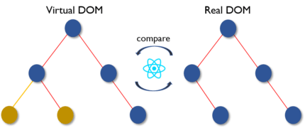

# 📘 Table of Contents

- [REST API](#-rest-api)
    - [1. 6 architectural constraints](#6-architectural-constraints)
    - [2. resource naming](#resource-naming)
    - [3. N + 1 Problem](#n+1-problem)
    - [4. HTTP Accept](#http-accept)
    - [5. HTTP Methods](#http-methods)
    - [6. HTTP Status Code](#http-status-code)
    - [7. HTTP Accept & HTTP Content-Type](#http-accept-&-http-content-type)
    - [8. Error Handling](#error-handling)
    - [9. Authentication vs Authorization](#Authentication-vs-Authorization)
    - [10. API Gateway](#api-gatewave)
- [JAVASCRIPT](#-javascript)
    - [1. Closures](#closures)
    - [2. Currying](#currying)
    - [3. Hoisting](#hoisting)
    - [4. Destructuring](#destructuring)
    - [5. Rest Parameters](#rest-parameters)
    - [6. Spread](#spread)
- [Docker](#-Docker)
- [Nginx](#-nginx)
- [ReactJS](#-reactjs)
    - [1. Feature of ReactJS](#1-feature-of-reactjs)
    - [2. React Dom](#2-react-dom)
    - [3. What is JSX?](#3-what-is-jsx)
    - [4. In React, everything is a component](#4-In-React,-everything-is-a-component)
    - [5. Render](#5-render)
    - [6. Props](#6-props)
    - [7. State](#7-state)
    - [8. Statefull and Stateless Component](#8-stateful-and-stateless-component)
    - [9. Lifecycle](#9-lifecycle)
    - [10. Event](#10-Event)
    - [11. Refs](#11-refs)
    - [12. ControlledComponent & UnControlledComponent](#12-controlledcomponent-&-uncontrolledcomponent)
    - [13. Pure Component](#13-pure-component)
    - [14. Key List](#14-key-list)
    - [15. Testing](#15-testing)
    - [16. Prop Drilling](#16-drop-drilling)
- [Redux](#-redux)
    - [1. Principles](#1-principles)
    - [2. Component of Redux](#2-component-of-redux)
    - [3. Action](#3-action)
    - [4. Reducer](#4-reducer)

## 📘 REST API
### 6 architectural constraints
1. Uniform interface
2. Client–server
3. Stateless
4. Cacheable
    - Expires
      ```
      Expires: Thu, 03 Dec 2020 23:02:37 GMT
      ```
    - Cache-Control
      ```
      Cache-Control: max-age=3600
      ```
    - Last-Modified
      ```
      Last-Modified: Mon, 07 Dec 2020 16:21:06 GMT
      ```
    - ETag
      ```
      ETag: "abcd1234567n34jv"
      ```
      [Read more](https://itplusx.info/restful-api-phan3-caching/)
5. Layered system
6. Code on demand (optional)

[Read more](https://restfulapi.net/rest-architectural-constraints/)

### Resource naming
1. document
2. collection
3. store
4. controller

[Read more](https://restfulapi.net/resource-naming/)

### N+1 Problem

>The idea is that insufficient information in collection resources may lead to the N+1 problem in REST APIs

> when you fetch parent and fectch N children

### HTTP Accept

```
Accept : text/html,application/xml
```
- `q` parameter

```
Accept : text/html, application/xml;q=0.9, */*;q=0.8
```
- > client is indicating the server that it will prefer to have the response in `text/html` format, first, and then `application/xml` and then `*/*`

- >  if both `application/xml` and `*/*` had a preference of 0.9 then application/xml will be served by the server.

- Erorr code
  - 406 (not acceptable)

### HTTP Methods

HTTP METHOD | CRUD | ENTIRE COLLECTION (E.G. /USERS) | SPECIFIC ITEM (E.G. /USERS/123)
--- | --- | --- | --- |
POST | Create | 201 (Created), ‘Location’ header with link to /users/{id} containing new ID. | Avoid using POST on single resource <br /> 201 (Created) <br /> 200 (OK) <br /> 204 (No Content)
GET | Read | 200 (OK), list of users. Use pagination, sorting and filtering to navigate big lists. | 200 (OK) <br /> single user. <br /> 404 (Not Found) if ID not found or invalid.
PUT | Update/Replace | 405 (Method not allowed), unless you want to update every resource in the entire collection of resource. | 200 (OK)  or 204 (No Content) <br /> Use 404 (Not Found), if ID not found or invalid.
PATCH | Partial Update/Modify | 405 (Method not allowed), unless you want to modify the collection itself. | 200 (OK) or 204 (No Content). Use 404 (Not Found), if ID not found or invalid.
DELETE | Delete | 405 (Method not allowed), 405 (Method not allowed), unless you want to delete the whole collection — use with caution. | 200 (OK) <br /> 404 (Not Found), if ID not found or invalid.

### HTTP Status Code
- 1xx: Informational – Communicates transfer protocol-level information.
- 2xx: Success – Indicates that the client’s request was accepted successfully.
 - 3xx: Redirection – Indicates that the client must take some additional action in order to complete their request.
- 4xx: Client Error – This category of error status codes points the finger at clients.
- 5xx: Server Error – The server takes responsibility for these error status codes.

> 406 is returned by the server when it can't `respond` based on accepting the request headers (ie they have an Accept header which states they only want XML).

> 415 is returned by the server when the entity sent in a `request` (content in a POST or PUT) has an unsupported mediatype (i.e. they sent XML).

> 406 when you can't send what they want, 415 when they send what you don't want.

### HTTP Accept & HTTP Content-Type

> `Accept` indicates what kind of response from the server the client can accept. `Content-type` always is about the content of the current request or response.

> if your request has no payload, you don't use a content-type request header.

[Read more](https://webmasters.stackexchange.com/questions/31212/difference-between-the-accept-and-content-type-http-headers)

[Read more](https://stackoverflow.com/questions/35722586/header-parameters-accept-and-content-type-in-a-rest-context)

### Error Handling
[Read more](https://www.ibm.com/docs/en/stea/10.0?topic=apis-error-handling-rest)

### Authentication vs Authorization

> `Authentication` confirms that users are who they say they are.<br />
`Authorization` gives those users permission to access a resource

[Read more](https://blog.restcase.com/4-most-used-rest-api-authentication-methods/)

### API Gateway

> An API gateway is an API management tool that sits between a client and a collection of backend services.

[Read more](https://viblo.asia/p/api-gateway-la-gi-tai-sao-mot-he-thong-microservices-lai-can-api-gateway-Do754pDX5M6)
## 📘 Javascript
### Closures
> Closure là một chức năng có quyền truy cập vào phạm vi cha, ngay cả sau khi scope đã đóng.

```
function speak() {
  var words = 'hi';
  return function logIt() {
    console.log(words);
  }
}

var sayHello = speak();
sayHello()
```

[Read more](https://anonystick.com/blog-developer/discuss-about-closures-in-javascript-2019051695927961.jsx)

### Currying

#### ES5

```
var add =   function (a){
    return function(b){
        return function(c){
            return a+b+c;
         }
    }
}
console.log(add(2)(3)(4)); //output 9
console.log(add(3)(4)(5)); //output 12
```

#### ES6

```
const add = (a, b) => a + b

add(1, 2) //should return 3

--------------------------

const add = a => b => a + b

add(1)(2) //should return 3
```

[Read more](https://anonystick.com/blog-developer/javascript-currying-in-javascript-2019050935248071)

### Hoisting

 > Khi một file javascript compiled bởi browser, nhưng trước khi nó thực sự executed thì Function declaration sẽ được stored in memory và được đẩy lên nhưng chính xác ta vẫn nhìn nó vẫn ở vị trí cũ. Và khi javascript file thực sự run thì browser thực sự đã biết những function đó trước khi đọc code của file javascript.

```
// Function declaration
function add(num1, num2) {
	return num1 + num2;
}

// Function expression
var add = function (num1, num2) {
	return num1 + num2;
};

```

#### How function declaration work

```
var salary = "1000$";

(function () {
  console.log("Original salary was " + salary);

  var salary = "5000$";

  console.log("My New Salary " + salary);
})();

Output:
  Original salary was undefined
  My New Salary 5000$

```

```

var salary = "1000$";

(function () {
  var salary = undefined;
  console.log("Original salary was " + salary);

  salary = "5000$";

  console.log("My New Salary " + salary);
})();

```


[Read more](https://anonystick.com/blog-developer/hoisting-javascript-la-gi-hoisting-tot-hay-xau-chi-can-1-phut-de-hieu-2020051681168206)

### Destructuring

> Allow set variables of Object or Array reduce line of code

- Destructuring Objects
  ```
  const person = {
    name: 'giang',
    age: 25
  }

  //original methods
  const name = person.name
  const age = person.age

  //destructuring
  const { name, age } = giang
  ```
- Destructuring Array
  ```
  const date = ['1996', '03', '08']

  //original methods
  const year = date[0]
  const month = date[1]
  const day = date[2]

  //destructuring
  const [year, month, day] = date
  ```
### Rest Parameters

> using when unspecifed parameter

- Rest
  ```
  function restTest(...args) {
    console.log(args)
  }
  restTest(1, 2, 3, 4, 5, 6);// [1, 2, 3, 4, 5, 6]
  ```

### Spread

> Can copy object, update object, merged array ...

- Copy object
  ```
  const person = {
    name: 'giang',
    age: 25
  }

  const p = person;
  p.name = 'test'

  console.log(person.name) //output: test
  console.log(b.name) //output: test
  ```

  ```
  const person = {
    name: 'giang',
    age: 25
  }

  const p = {...person};
  p.name = 'test'

  console.log(person.name) //output: giang
  console.log(b.name) //output: test
  ```
- Merged array
  ```
  const arr = [🤷‍♂️,👀,🐱‍🚀]
  const arr1 = [🐱‍🏍,🐱‍👤]

  const mergedArray = [...arr,...arr1]
  //mergedArray: [🤷‍♂️,👀,🐱‍🚀,🐱‍🏍,🐱‍👤]
  ```

## 📘 Docker
- Dockerfile build image -> run conatiner from image

1. Dockerfile
2. Docker-compose
3. Docker build
4. images

## 📘 Nginx
> Webserver kiến trúc hướng sự kiện (event-driven) không đồng bộ (asynchronous)

> Tuy nhiên, NGINX hoạt động theo kiến trúc bất đồng bộ (asynchronous) hướng sự kiện (event driven). Nó cho phép các threads tương đồng được quản lý trong một tiến process. Mỗi process hoạt động sẽ bao gồm các thực thể nhỏ hơn, gọi là worker connections dùng để xử lý tất cả threads.

> Worker connections sẽ gửi các yêu cầu cho worker process, worker process sẽ gửi nó tới master process, và master process sẽ trả lời các yêu cầu đó. Đó là lý do vì sao một worker connection có thể xử lý đến 1024 yêu cầu tương tự nhau. Nhờ vậy, NGINX có thể xử lý hàng ngàn yêu cầu khác nhau cùng một lúc.

#### Some feature of Nginx
1. Can hanlde 10000 request at the same time
2. Static file
3. Proxy
4. Rewrite url
5. limit connection
6. support websocket
7. support flv and mp4

[Read more](https://wiki.matbao.net/nginx-la-gi-huong-dan-kiem-tra-va-cai-dat-nginx-server/)

## 📘 ReactJS

### 1. Feature of ReactJS
  - Major feature
    - It uses the `virtual DOM` instead of the `real DOM`.
    - It uses `server-side rendering`.
    - It follows `uni-directional` data flow or data binding.
  - Major advantages
    - It increases the application’s performance.
    - Using JSX, code’s readability increases
  - Limitations of React?
    - Its library is very large and takes time to understand
    - It can be little difficult for the novice programmers to understand
    - Coding gets complex as it uses inline templating and JSX

### 2. React DOM
  - Differentiate between Real DOM and Virtual DOM
    RealDOM | VituralDOM
    --- | ---
    It updates slow. | It updates faster
    Can directly update HTML. |	Can’t directly update HTML
    Creates a new DOM if element updates.	| Updates the JSX if element updates.
    DOM manipulation is very expensive | DOM manipulation is very easy
    Too much of memory wastage. | No memory wastage
  - What do you understand by Virtual DOM? Explain its working.
    1. Whenever any underlying data changes, the entire UI is re-rendered in Virtual DOM representation.<br/>
    
    2. Then the difference between the previous DOM representation and the new one is calculated<br/>
    
    3. Once the calculations are done, the real DOM will be updated with only the things that have actually changed.<br/>
    

### 3. What is JSX?
  - JSX is a shorthand for JavaScript XML. This is a type of file used by React which utilizes the expressiveness of JavaScript along with HTML like template syntax. This makes the HTML file really easy to understand.

### 4. In React, everything is a component
  - ReactJS building based on component Reusable. These components split up the UI to small component and reusable. Then it `render` each component independent of each with out effecting the rest ui.

### 5. Render
  - Each React component must have `render()`
  - `render()` will return sigle element repersent on DOM
  - if more than one HTML elemnt you should grouped by closeing tag such as `<div>`, `<form>`, etc...
  - This must be kept `pure` return same value each time it invoked

### 6. Props
  - `Props` is `properties` of React
  - `Props` using passing value from parent to child
  - A child component cann't send back `props` to parent
  - `Props` is a `readonly` and cann't change `inside` component

### 7. State
  - `state` using inside component and can change value
  - Whatever `state` change component will re-render
  - Parent component cann't change `state` in child component

### 8. Statefull and Stateless Component
  Stateful Component | Stateless Component
  --- | ---
  Have authority to change state | Do not have the authority to change state
  Stores info about component’s state change in memory | Calculates the internal state of the components
  impure | pure

### 9. Lifecycle
  - 3 stages of React
    - Mounting: When component created and render to DOM
    - Updating: component updating when `props` or `state` change
    - Unmounting: when component destroy

  > `Hooks` are a new addition in React 16.8. They let you use state and other React features without writing a class.

  - ComponentDidMount: only called once after component rendered <br/>
    eg: fetch data, add event listener

    - with `Hooks`
    ```
    useEffect(() => {
      // fetch data
    },[]); // with empty array
    ```
  - ComponentDidUpdate: happens when props or state change and component render

    - with `Hooks`
    ```
    useEffect(() => {
      // handle when data change
    },[param]);
    ```
  - ComponentWillUnMount: called before component destroyed
    - with `Hooks`
    ```
    useEffect(() => {
      return () => {
        //unsubscribe Event
      }
    },[]);

  - ShouldComponentUpdate: using when you want component render or not by return `true` or `false`

  - getDerivedStateFromProps & getSnapshotBeforeUpdate
    - It not used often

  > Flow when state or props change <br/>
      1. getDerivedStateFromProps<br/>
      2. shouldComponentUpdate<br/>
      3. componentWillUpdate<br/>
      4. Render<br/>
      5. ComponentDidUpdate<br/>

### 10. Event
  - events are the triggered reactions to specific actions like mouse hover, mouse click, key press, etc
    > Events are named using camel case instead of just using the lowercase. <br/>
      Events are passed as functions instead of strings.
    ```
    <button onClick={eventClickHanlder}></button>
    ```

### 11. Refs
  - store references to a particular React element or component returned by render
  - eg: control focus, Integrate with third party, Select text

### 12. ControlledComponent & UnControlledComponent
  Controlled Components | Uncontrolled Components
  --- | ---
  Data is controlled by the parent component | Data is controlled by the DOM
  They take in the current values through props and then notify the changes via callbacks | Refs are used to get their current values

### 13. Pure Component
  - reduce render unnecessary and improve performace but it can happens errors if handle not well
  - Pure Component using `shallow equality` about `props` and `state` before decide render or not

  [Read More](https://viblo.asia/q/component-vs-purecomponent-MnKMv99EZ7P)

### 14. Key List
  - `Keys` helps react identify which item changed, added, removed
  - `Keys` should be stable identify in list or array
  - Can using ID of list element as `keys`

### 15. Testing
  - Jest
  - @testing-library/react-hooks
  - Sinon, chai

### 16. Prop Drilling
  - `Prop drilling` occurs when you want passing `prop` from parent component to low level component and that component no need using this `prop`
    - eg: propsX AComponent -> BComponent -> CComponent
  - Using react Context API to managed state
## 📘 Redux

### 1. Principles
  - `Single source of truth`: the state of entrie application is stored in object/state tree. It's help control state synchonously. Single state tree also make easier to debug and inspect application
  - `State is read-only`: The only way change state to emit action. An action is a plain object describing the change.
  - `Changes are made with pure functions`: To Specifed how the state tree is transformed. using reducer. Reducer is pure function and receive `prevState` and an `action` and return `nextState`.

### 2. Component of Redux
  - `Action`: Object describing what happens
  - `Reducer`: It is a place to determine how the state will change
  - `Store`: State/ Object tree of the entire application is saved in the Store.
  - `View`: Simply displays the data provided by the Store

### 3. Action
  - An `action` must have property `type` that indicates the type of ACTION being performed.
  - `type` is a string contranst

### 4. Reducer
  - `Reducer` is pure function specified how to application's state change.
  - `Reducer` happens when `action` have been dispatch and base on `type` property update state and return `new state`
  - `Reducer` will return previous state if no work needs to be done.
